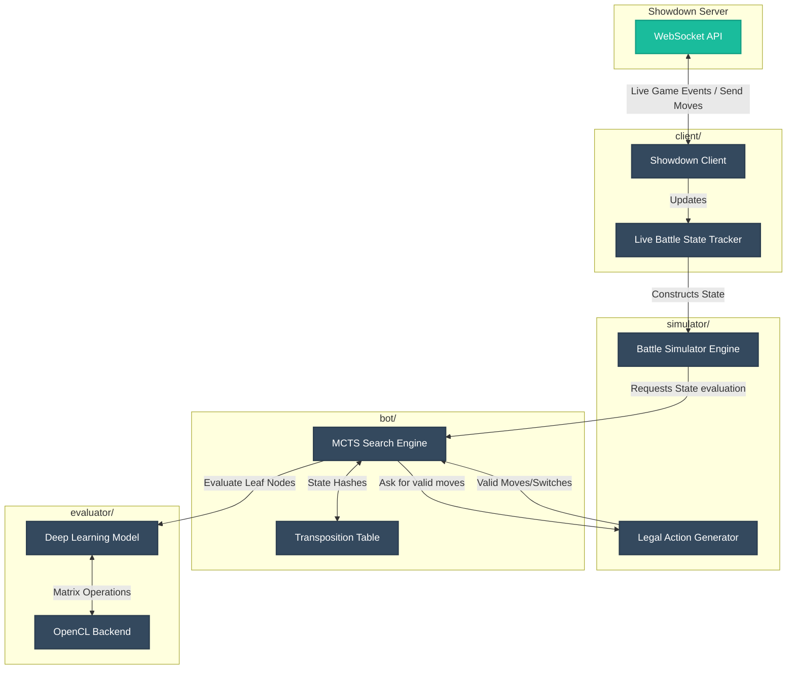
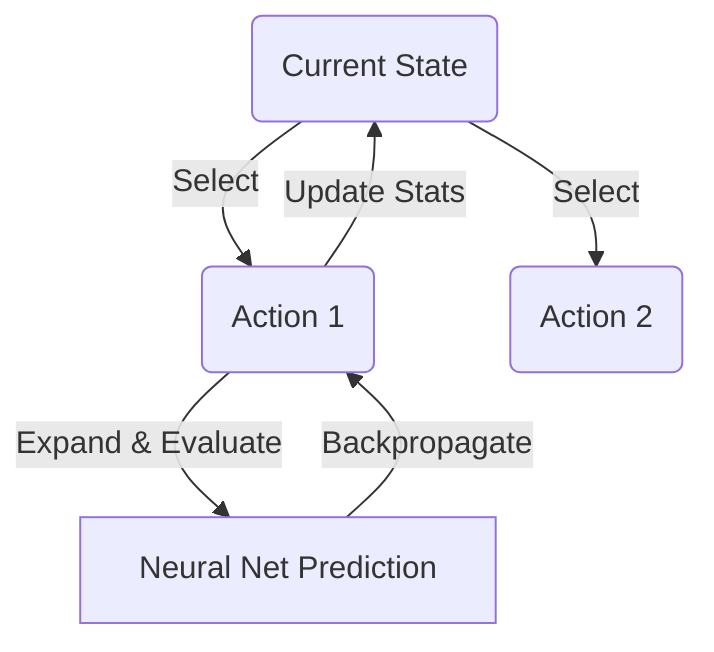
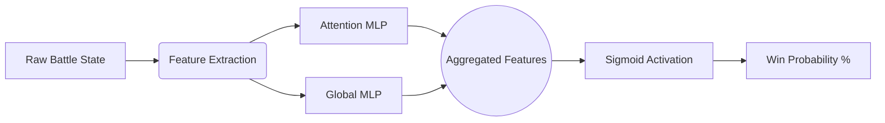

# Pokemon Engine AI

A sophisticated high-performance AI bot and evaluation engine for Pokémon Showdown, written in Go. This project implements a fully functional offline battle simulator, deep-learning based position evaluation using Self-Attention, and Monte Carlo Tree Search (MCTS) capabilities to find the optimal moves in dynamic game states.

## 🌟 Overview

This engine provides a full pipeline from data gathering (scraping and parsing Showdown replays), off-line reinforcement learning and NN training, deep search evaluation (MCTS), to a live bot instance capable of connecting to Pokemon Showdown and playing matches autonomously.

### Core Features
- **Live Bot Client:** Connects to Pokemon Showdown websocket, parses live game streams, and computes/sends moves asynchronously within time budgets.
- **Deep Learning Evaluator:** Neural Network evaluator architecture utilizing Self-Attention layers and multi-layer perceptrons (MLPs). Capable of predicting win probabilities using OpenCL-accelerated hardware.
- **MCTS Search Engine:** Explores future action paths using Monte Carlo Tree Search, leveraging neural network evaluations to iteratively build a search tree and find optimal moves.
- **Full Battle Simulator:** Accurately models Pokémon stats, field conditions, move damages, type effectiveness, and dynamic mechanics (e.g., Terastallization).
- **Self-Play & Offline Training:** Features commands to parse existing replays, generate tagged evaluation states, train models via gradient descent (Adam optimizer), and perform self-play to iteratively improve model strength.

---

## 🏗️ Architecture & How It Works

This project is broken down into structured systems. At a high level, the pipeline for the **Live Bot** connects the network, simulator, and reasoning engine together:



### 1. Showdown Client (`client/`)

The client manages the WebSocket connection to Pokemon Showdown, handles authentication, accepts challenges, and processes incoming game events formatted in Showdown protocol. It updates an internal mirror of the battle state dynamically.

### 2. Battle Simulator (`simulator/`)

A high-performance offline engine. Because the main Showdown simulator relies heavily on JavaScript, this project rewrites the core battle flow and state definition in Go. It determines legally possible switches and moves, including checking for edge cases, move-aware damage, and correctly simulating fast-forward states.

### 3. MCTS Search Engine (`bot/`)

The bot navigates a game tree of possible actions using Monte Carlo Tree Search to find the optimal move.



The search algorithm iteratively runs simulations, balancing exploration of new moves and exploitation of promising variations guided by the neural network's evaluations.

### 4. Neural Network Evaluator (`evaluator/`)

Evaluates the heuristic "score" of any internal simulator state (represented as a win probability between `0.0` and `1.0`).



The Evaluator can train locally over replays to adjust model weights using the Adam optimizer to combat the "Attention Plateau".

---

## 🚀 CLI Commands

The engine is controlled via the `main.go` entry point. Here are the primary commands:

### Running the Live Bot
```bash
go run . -cmd live -user <BotName> -pass <Password>
```
Connects to Showdown and begins accepting random battle challenges.

### Offline Utility Commands
* **`scrape`**: Download replays from Pokemon Showdown. ` -format gen9randombattle -num 100`
* **`parse`**: Extract structured data from raw log files.
* **`evaluate`**: Predict win probability at a specific turn from a replay.
* **`search-evaluate`**: Run deep MCTS search on a replay turn.

### Training & Self-Play
The training pipeline requires replay data:
```bash
# 1. Gather games
go run . -cmd scrape -format gen9randombattle -out data/replays -num 1000

# 2. Tag states (Uses search to label datasets)
go run . -cmd tag -in data/replays -tagged data/tagged -depth 2

# 3. Train the Deep Learning Network
go run . -cmd train-tagged -tagged data/tagged -epochs 10
```

Additional Commands:
* `selfplay`: Generate synthetic matches via AI vs AI games.
* `mixed-train`: Train the network using a mix of fast depth-0 targets and hard search targets.

## 📂 File Structure

- `bot/` : Search engine implementations (`SearchEvaluate`, MCTS experiments)
- `client/` : Network connectivity and real-time battle tracking for Showdown.
- `evaluator/` : Neural Network implementation, GPU backend connections, and Gradient Descent logic.
- `gamedata/` : Static game knowledge bases (`moves.json`, `pokedex.json`) matching generation data.
- `parser/` : Replay parser to convert Showdown logs into replay events.
- `scraper/` : Utilities for bulk downloading replay data for offline training.
- `simulator/` : Fast deterministic battle engine for move generation and state prediction.
- `main.go` : Application entrypoint and CLI handler.

---

*Written in Go. Uses OpenCL for neural network acceleration.*
